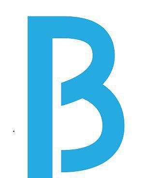

# BUILD Token smart contract

* _Standard_                                                                            : [ERC20](https://github.com/ethereum/EIPs/blob/master/EIPS/eip-20.md)
* _[Name](https://github.com/ethereum/EIPs/blob/master/EIPS/eip-20.md#name)_            : BUILD
* _[Ticker](https://github.com/ethereum/EIPs/blob/master/EIPS/eip-20.md#symbol)_        : BUILD
* _[Decimals](https://github.com/ethereum/EIPs/blob/master/EIPS/eip-20.md#decimals)_    : 18
* _Emission_                                                                            : Mintable
* _Crowdsales_                                                                          : 2
* _Fiat dependency_                                                                     : No
* _Tokens locked_                                                                       : Yes

## Smart-contracts description

Extended tokens are minted after the all stages are finished.  
There is a special function to return 3rd party tokens that were sent by mistake (function retrieveTokens()).  
Each stage has a direct minting function in wei. This is made to support the external payment gateways.

### Contracts contains
1. _Token_ - Token contract
2. _PreITO_ - PreITO contract
3. _ITO_ - ITO contract
4. _Configurator_ - contract with main configuration for production

### How to manage contract
To start working with contract you should follow next steps:
1. Compile it in Remix with enamble optimization flag and compiler 0.4.18
2. Deploy bytecode with MyEtherWallet. Gas 5100000 (actually 5073514).
3. Call 'deploy' function on addres from (3). Gas 4000000 (actually 3979551). 

Contract manager must call finishMinting after each crowdsale milestone!
To support external mint service manager should specify address by calling _setDirectMintAgent_. After that specified address can direct mint tokens by calling _mintTokensByETHExternal_ and _mintTokensExternal_.

### How to invest
To purchase tokens investor should send ETH (more than minimum 0.1 ETH) to corresponding crowdsale contract.
Recommended GAS: 250000, GAS PRICE - 21 Gwei.

### Wallets with ERC20 support
1. MyEtherWallet - https://www.myetherwallet.com/
2. Parity 
3. Mist/Ethereum wallet

EXODUS not support ERC20, but have way to export key into MyEtherWallet - http://support.exodus.io/article/128-how-do-i-receive-unsupported-erc20-tokens

Investor must not use other wallets, coinmarkets or stocks. Can lose money.

## Tokens distribution

* _Bounty tokens percent_       : 2% - locked untill 30 days after ITO
* _Advisors tokens percent_     : 3%
* _Founders tokens percent_     : 11%
* _Company tokens percent_      : 4%
* _PreITO + ITO_                : 80%

## Main network configuration

* _Bounty tokens wallet_        : 0x3180e7B6E726B23B1d18D9963bDe3264f5107aef
* _Advisors tokens wallet_      : 0x36A8b67fe7800Cd169Fd46Cd75824DC016a54d13
* _Founders tokens wallet_      : 
* _Company tokens wallet_       : 0x7D648BcAbf05CEf119C9a11b8E05756a41Bd29Ad
* _Contracts manager_           :

### Links
1. _Token_ -
2. _PreITO_ -
3. _ITO_ -

### Features
* Manually mint tokens by owner or sale agent at any time until token minting finished. 
* Manually mint tokens in ether value by owner or sale agent at corresponding sale contract during current sale processing.  

### Crowdsale stages

#### PreITO
* _Minimal insvested limit_     : 0.1 ETH
* _Base price_                  : 1 ETH = 6650 Tokens
* _Softcap_                     : 3500 ETH
* _Hardcap_                     : 12 000 ETH
* _Period_                      : 42 days
* _Start_                       : 
* _Wallet_                      : 0xB53E3f252fBCD041e46Aad82CFaEe326E04d1396

#### ITO
* _Minimal insvested limit_     : 0.1 ETH
* _Base price_                  : 1 ETH = 5000 Tokens
* _Hardcap_                     : 23 000 ETH
* _Start_                       : 
* _Wallet_                      : 0x8f1C4E049907Fa4329dAC9c504f4013620Fa39c9

##### Milestones
1. 15 days, bonus +25%
2. 15 days, bonus +20%
3. 15 days, bonus +15%
4. 15 days, bonus +10%
5. 15 days, bonus +5%
6. 15 days, without bonuses

